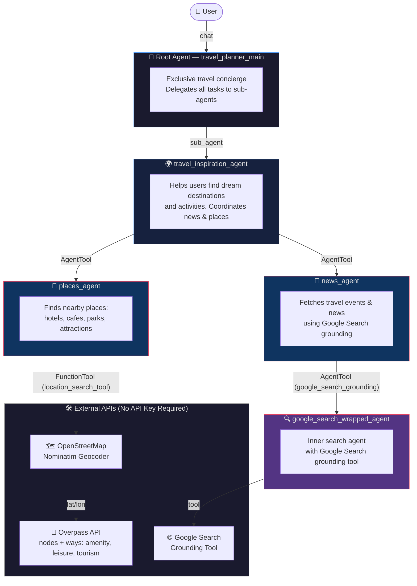

# ✈️ Travel Planner with Google ADK

A multi-agent AI travel concierge built with the **Google Agent Development Kit (ADK)**. It helps users discover dream destinations, explore travel news & events, and find nearby places — all powered by Gemini and free open-source APIs.

---

## 🏗️ Agent Architecture



---

## 🧩 Agent Breakdown

| Agent | Model | Role |
|-------|-------|------|
| `travel_planner_main` | `gemini-2.5-flash-lite` | Root concierge — routes all user queries to sub-agents |
| `travel_inspiration_agent` | `gemini-2.5-flash-lite` | Coordinates destination discovery and activity ideas |
| `news_agent` | `gemini-2.5-flash-lite` | Fetches current travel events & news via Google Search |
| `places_agent` | `gemini-2.5-flash-lite` | Finds specific nearby places (hotels, parks, cafes, etc.) |
| `google_search_wrapped_agent` | `gemini-2.5-flash-lite` | Inner search agent that wraps Google Search as an AgentTool |

### 🛠️ Tools

| Tool | Type | API Used | API Key? |
|------|------|----------|----------|
| `google_search_grounding` | `AgentTool` | Google Search (grounding) | ✅ Gemini API Key |
| `location_search_tool` | `FunctionTool` | OpenStreetMap + Overpass API | ❌ Free / No key |

---

## 📁 Project Structure

```
travel-planner-with-adk/
├── travel_planner/
│   ├── __init__.py           # Package initializer
│   ├── agent.py              # Root agent definition
│   ├── supporting_agents.py  # Inspiration, News, Places agents
│   ├── tools.py              # google_search_grounding + location_search_tool
│   └── .env                  # API key (⚠️ not committed to git)
├── .env.example              # Template for required environment variables
├── .gitignore
├── pyproject.toml            # Project dependencies (uv)
└── README.md
```

---

## 🚀 Getting Started

### Prerequisites

- Python `>= 3.12`
- [`uv`](https://github.com/astral-sh/uv) package manager
- A [Google Gemini API Key](https://aistudio.google.com/app/apikey)

### 1. Clone the Repository

```bash
git clone <your-repo-url>
cd travel-planner-with-adk
```

### 2. Set Up Environment Variables

```bash
cp .env.example travel_planner/.env
```

Edit `travel_planner/.env` and add your key:

```env
GOOGLE_API_KEY=your_google_api_key_here
```

### 3. Install Dependencies

```bash
uv sync
```

### 4. Run the ADK Web UI

```bash
uv run adk web
```

Then open your browser at: **http://127.0.0.1:8000**

---

## 💬 Example Queries

| Query | Agent Invoked |
|-------|---------------|
| *"What are the best places to visit in Japan?"* | `travel_inspiration_agent` |
| *"Find hotels near the Eiffel Tower"* | `places_agent` → Overpass API |
| *"What travel events are happening in Barcelona?"* | `news_agent` → Google Search |
| *"Find parks in New York"* | `places_agent` → OSM + Overpass |
| *"Plan a 5-day trip to Bali"* | Full agent chain |

---

## 🔧 How the Location Search Works

The `location_search_tool` uses **100% free APIs** — no third-party key needed:

1. **Nominatim** (OpenStreetMap) geocodes the location string → `(lat, lon)`
2. **Overpass API** searches the surrounding area for matching:
   - `node` and `way` (polygon) elements
   - Tags: `amenity`, `leisure`, `tourism`, `shop`, `name`
3. Results are formatted as a human-readable list with names & addresses

> **Why both `node` and `way`?** Parks, beaches, and gardens in OSM are polygon areas (`way`) tagged with `leisure=park` — not point nodes — so querying only nodes misses them entirely.

---

## 📦 Dependencies

```toml
dependencies = [
    "geopy>=2.4.1",       # Geocoding via Nominatim
    "google-adk>=1.32.0", # Google Agent Development Kit
    "python-dotenv>=1.2.2" # .env file loading
]
```

---

## 🔒 Security Notes

- **Never commit your `.env` file** — it's listed in `.gitignore`
- Use `.env.example` as a safe template to share required variables
- Your `GOOGLE_API_KEY` grants access to Gemini API — keep it private

---

## 🛣️ Roadmap

- [ ] Add itinerary generation with day-by-day planning
- [ ] Integrate flight & hotel pricing APIs
- [ ] Add persistent memory for returning users
- [ ] Build a custom web UI (replace ADK dev UI)
- [ ] Add weather information tool

---

## 📄 License

MIT License — feel free to use, modify, and distribute.
